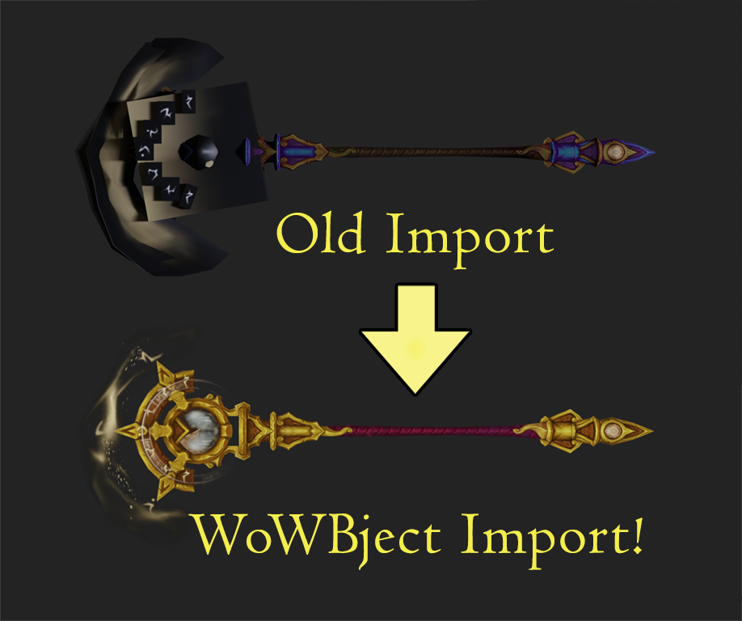
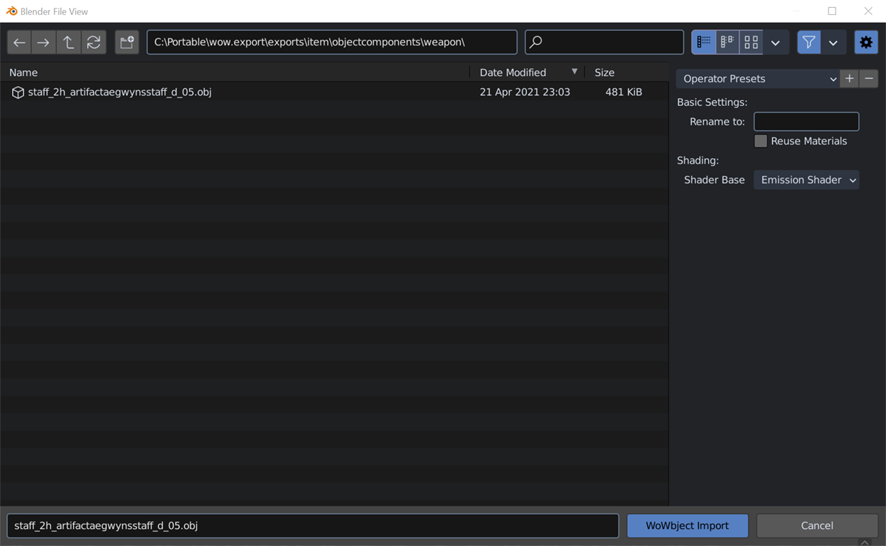
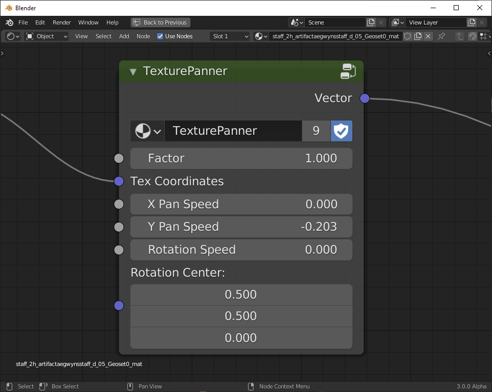

# WoWbject: A World of Warcraft Model Importer

TL;DR: This Blender add-on + WoW.Export = Streamlined material assignment with accurate shaders and animated UVs, with more features to come.

## Features

### Current Features

- Imports OBJ files as exported by wow.export
- Automatically applies game textures, using game-accurate shaders, reproduced using standard Blender node trees
- Automatically sets up UV animations (for magic effects, etc.) to animate in the correct ways, with correct timings
- Can create node trees based on emissive shaders (most true to WoW), diffuse shaders, specular shaders, or the principled shader

### Current Non-features/Mis-features

- For full functionality, you will need to export the model from wow.export twice (see "Using")
- Other than UV animation, does not attempt any sort of model animation (this will be addressed when wow.export supports animation export)
- Design and testing has been focused primarily on weapons and armors, other things (characters, monsters, maps) have not been particularly tested, though the set of shader nodes provided should be largely applicable to anything you might import, even if the texture assignment isn't automatic
- In particular, you're on your own when it comes to character models (though our collection of shaders should be quite useful for them)
- Particle system ... particles ... are not supported
- It is possible that models originated in older expansions may not import, or may not import correctly (we haven't investigated)
- It's possible that some shaders are not implemented completely correctly and we simply haven't observed them in a situation that makes the error obvious
- Objects that are themselves translucent will not perfectly match in-game translucency effects, because Blender does not have all of the blending modes available to do so (though a future release may provide some tooling for helping with this)
- "billboard" textures and sub-meshes (ones where the same side always "faces" the camera) are not currently supported.

### Future Plans

Things we are actively looking at doing in the near(ish) future:

- Item animations (spinning crystals, that kind of thing)
- Simple particle effects (magic auras and such on items)
- Less-simple particle effects
- Spell effects
- Automatic texture upscaling with correct handling of alpha channels
- Other things that a human shouldn't have to do but currently have to (feel free to make suggestions)

## Installing

Install as any other addon, access via `File > Import > WoWbject`. You will also need Kruithne's wonderful [wow.export](https://github.com/Kruithne/wow.export) so that you'll be able to have something you can import. The WoWbject importer currently *requires* several features that are exclusive to wow.export, so don't try to use other export tools right now.

## Using

WoWbject Import is built to work with WoW.Export, and it reads both the JSON files that WoW.Export produces and the raw m2 files that it can export. You will need to install wow.export and have it configured in a specific way (in the wow.export settings page):

- **Enable Shared Textures** must be *disabled*
- **Export Additional UV Layers** must be *enabled*
- **Export Meta Data** must be *enabled for at least M2 files*

**You will need to export the model twice:** The importer needs two different types of files from wow.export, so  Use "**export as OBJ**", followed by "**export as M2 / WMO (Raw)**". If you are in a hurry you can skip the M2/RAW step, though you will lose some features by doing so (primarily UV animation setup). We may remove the double-export requirement at some point in the future, but it's easy enough to do the double export that it's not at the top of our list.

Like most Blender importers, you'll find the WoWbject import operator in the File→Import menu. Click it, and it'll pop up a file browser that looks something like this:

Select the `.obj` file you want to import, pick what base shader configuration you want to use, click import, and you're good to go. For the closest to "in-game" texturing, the emission-based shader will be the best choice. If that shader doesn't meet your needs, give the others a try! The names are relatively self-explanatory, e.g. the 'diffuse' type uses a diffuse shader rather than an emissive one. Intuitive!

WoWbject relies on name matching to find the files it needs to import assets correctly. This means that the JSON, mtl, and m2 files that go with a particular `.obj` **must have matching names**. This is the normal behavior of wow.export if you don't rename any files after export.

The add-on will figure out which textures it should use, how they're combined, and if/how they use animated UVs based on what's in these files. It will also search for textures in a `textures` subdirectory, if one exists in the same directory as the `.obj` file being imported.

For assets that have UV animations, the add-on uses a driver inside of a node group, which means that, if you want to adjust the speed/direction of a UV animation, the settings are all on this node right here:

The node automatically compensates for the frame rate of the scene that is active when the object is imported. It does this by referencing the scene's frame rate in the driver that the add-on sets up. As a result, if you import an object with UV animations into one file, and then append that object into another file, it will also append the scene that the driver references. You will almost certainly want to avoid this by removing the driver from the node before appending an object to another scene.

## Options and Preferences

The add-on preferences are relatively simple at the moment. Setting the Report Verbosity changes what kinds of reports the importer shows in the info editor, console, and status bar. It defaults to only showing warnings and errors. The updater settings control if and how frequently the add-on checks for updates, and are largely self-explanatory.

## Reporting Bugs (and Feature Requests)

We want the WoWbject Importer to be as accurate as possible when importing objects from WoW. If you run into situations where you think the importer is doing the wrong thing, *please* open an issue on the WoWbject Importer [issues page](https://github.com/ThatAsherGuy/WoWbjectImporter/issues) so that we can investigate!

We will also gladly accept feature requests via the same page. We can't guarantee we can implement everything requested, but we'll sure as heck give consideration to anything reasonable!

## License

As with all Blender addons, the WoWbject Importer is licensed under the GNU GPL. See the included [LICENSE](LICENESE) for specifics.

## Credits

This project was researched and beaten into existence through sheer force of will by [TDV Alinsa](https://github.com/alinsavix), who then conscripted [Asher Stephenson](https://github.com/ThatAsherGuy) to do much of the heavy lifting. I think we were both surprised how deep this particular rabbit hole went!

Also, endless appreciation to Kruithne for both their awesome [wow.export](https://github.com/Kruithne/wow.export), and for tolerating way too many questions from Alinsa about various nitpicky WoW innards. By proxy, special thanks to Marlamin as well, creator of [WoW Export Tools](https://github.com/Marlamin/WoWExportTools/), on which wow.export is based.

(We are also intending to contribute our work back to Kruithne and the wow.export project after we've implemented more of what we intend to implement, and the dust has settled a bit.)

Many thanks to everyone who has contributed to the [WoWDev wiki](https://wowdev.wiki/), for helping to provide an amazing resource for those who have come after them (like us). We build on the shoulders of giants.

This add-on relies on an external python module called `kaitastruct`, which it uses to read additional data from .m2 files. The module is bundled with the add-on — you don't need to install or configure anything — but makes possible some of the things this importer does. Check out the [Kaitai Struct repo](https://github.com/kaitai-io/kaitai_struct_python_runtime). It's an awesome project. You can also find our work-in-progress on defining WoW data structures with kaitai-struct in Alinsa's [kaitai-warcraft](https://github.com/alinsavix/kaitai-warcraft) repo.

And finally, many kudos to the [Blender Foundation](https://www.blender.org/foundation/) and the numerous contributors to the Blender project, for providing such amazing software for us to build on. For all its flaws, it is still amazing that software of this size and breadth is available for free to anyone who cares to use it.

## Changelog

**v1.0.0:**

- Fixed: The importer can now handle meshes with duplicate faces
- Fixed: No longer explodes on OS X (file path handling)
- Changed: All reports are logged to the console, regardless of UI report settings
- Added: Can now set a default import directory

**v0.9.0:**

- First Release
